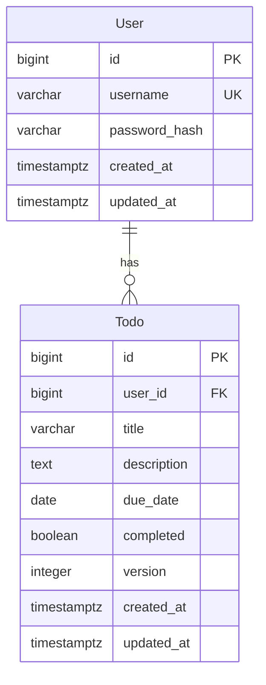

[ARTIFACT]
type: TechDesign
version: 1
status: draft

# 技术设计文档

## 1. 技术选型

| 组件 | 选型 | 说明 |
|------|------|------|
| 后端语言 | Go 1.21+ | 高性能、编译型、适合 API 服务 |
| Web 框架 | Gin v1.9+ | 轻量、高性能、路由/中间件丰富 |
| 数据库 | PostgreSQL 15+ | 符合 ACID，支持 JSON、索引、事务 |
| 缓存/消息队列 | 无 | 当前业务无需引入，通过数据库优化满足性能基线 |
| JWT 库 | github.com/golang-jwt/jwt/v5 | 提供 JWT 签名和验证（HS256） |
| 密码哈希 | golang.org/x/crypto/bcrypt | bcrypt 加密存储密码 |
| 参数校验 | github.com/go-playground/validator/v10 | 结构体标签校验（request body 和 query） |
| 数据库驱动 | github.com/jackc/pgx/v5 | 高性能 PostgreSQL 驱动，支持连接池 |
| 数据库迁移 | github.com/golang-migrate/migrate/v4 | 文件化版本迁移，支持 up/down |
| 配置管理 | 环境变量 + viper（可选） | 读取环境变量即可，暂不强制依赖 |

## 2. 数据库设计

### 2.1 ER 图（Mermaid）



### 2.2 DDL

```sql
-- users 表
CREATE TABLE users (
    id            BIGSERIAL PRIMARY KEY,
    username      VARCHAR(20) NOT NULL,
    password_hash VARCHAR(255) NOT NULL,
    created_at    TIMESTAMPTZ NOT NULL DEFAULT NOW(),
    updated_at    TIMESTAMPTZ NOT NULL DEFAULT NOW()
);

-- username 唯一约束（小写存储固定唯一）
CREATE UNIQUE INDEX idx_users_username ON users (username);

-- trigger 自动更新 updated_at（可选，也可在代码中维护）

-- todos 表
CREATE TABLE todos (
    id          BIGSERIAL PRIMARY KEY,
    user_id     BIGINT NOT NULL REFERENCES users(id) ON DELETE CASCADE,
    title       VARCHAR(255) NOT NULL,
    description TEXT,
    due_date    DATE,
    completed   BOOLEAN NOT NULL DEFAULT FALSE,
    version     INTEGER NOT NULL DEFAULT 1,
    created_at  TIMESTAMPTZ NOT NULL DEFAULT NOW(),
    updated_at  TIMESTAMPTZ NOT NULL DEFAULT NOW()
);

-- 加速按用户查询
CREATE INDEX idx_todos_user_id ON todos (user_id);

-- 加速按用户和创建时间倒序排序
CREATE INDEX idx_todos_user_created_desc ON todos (user_id, created_at DESC);
```

### 2.3 Migration 策略

- 使用 `golang-migrate/migrate` 管理迁移文件。
- 迁移文件位于 `migrations/` 目录，命名规则 `{timestamp}_{title}.up.sql` 和 `{timestamp}_{title}.down.sql`。
- 首次迁移包含上述两张建表语句。
- 应用启动时自动执行迁移（通过 `cmd/server` 的 init 逻辑，或单独 `migrate` 命令）。
- 生产环境通过 CI/CD 执行迁移，确保与代码版本一致。

## 3. 模块划分

| 模块 | 职责 | 依赖 |
|------|------|------|
| `auth` | 用户注册、登录、JWT 生成 | database, bcrypt, jwt |
| `todo` | 待办 CRUD、列表分页、乐观锁控制 | database, jwt (从 context 取 user_id) |
| `middleware` | 认证中间件（JWT 验证）、错误处理中间件、请求日志中间件 | jwt, logger |
| `database` | 数据库连接池、迁移执行 | pgx, migrate |
| `config` | 加载配置（环境变量） | 无（或 viper） |

**模块间依赖关系**：
- `auth` 和 `todo` 通过 `database` 包访问数据，不直接访问其他业务模块。
- `middleware` 在路由层注入，不依赖具体业务模块（通过 context 传递 user_id）。
- `config` 是全局独例，供所有模块读取。

## 4. 目录结构

```
backend/
├── cmd/
│   ├── server/
│   │   └── main.go          # 入口：加载配置、初始化数据库、启动 HTTP Server
│   └── migrate/
│       └── main.go          # 手动迁移命令（可选）
├── internal/
│   ├── auth/
│   │   ├── handler.go       # 注册/登录 HTTP Handler
│   │   ├── service.go       # 业务逻辑：密码验证、创建用户
│   │   ├── repository.go    # 数据库查询（用户查询、插入）
│   │   └── dto.go           # 请求/响应结构体
│   ├── todo/
│   │   ├── handler.go       # 待办 CRUD Handler
│   │   ├── service.go       # 业务逻辑：权限校验、版本号乐观锁
│   │   ├── repository.go    # 数据库查询（待办增删改查）
│   │   └── dto.go           # 请求/响应结构体
│   ├── middleware/
│   │   ├── auth.go          # JWT 认证中间件
│   │   ├── error.go         # 统一错误响应中间件（恢复&自定义错误）
│   │   └── logger.go        # 请求日志中间件
│   ├── database/
│   │   ├── postgres.go      # 数据库连接初始化 & 连接池配置
│   │   └── migrate.go       # 迁移执行逻辑
│   └── config/
│       └── config.go        # 环境变量读取结构体
├── migrations/
│   ├── 20250301000001_create_users.up.sql
│   ├── 20250301000001_create_users.down.sql
│   └── 20250301000002_create_todos.up.sql
│   └── 20250301000002_create_todos.down.sql
├── go.mod
├── go.sum
├── Dockerfile
└── Makefile 或 .env 示例
```

**关键说明**：
- `repository` 层负责 SQL 交互，`service` 层负责业务规则和校验，`handler` 层负责 HTTP 输入输出。
- 所有 handler 均不直接访问数据库，通过 service 调用 repository。
- `middleware/error.go` 捕获所有 panic 和业务错误，统一输出 `ErrorResponse`。

## 5. 中间件设计

### 5.1 认证中间件（JWT 校验）

- **路径**：`internal/middleware/auth.go`
- **流程**：
  1. 从 `Authorization` 头解析 `Bearer {token}`。
  2. 若缺失或格式错误，直接返回 401。
  3. 使用 HS256 密钥解析 JWT（`golang-jwt/jwt/v5`）。
  4. 若 Token 过期或签名无效，返回 401。
  5. 从 Claims 中提取 `user_id` 字段，并写入 Gin 上下文 `c.Set("user_id", userID)`。
  6. 后续 handler 从上下文取 `user_id`。
- **使用**：在路由分组“/todos”上应用该中间件，使所有待办接口必须认证。同时可全局应用（但 auth 自身的两个端点无需认证）。

### 5.2 错误处理中间件

- **路径**：`internal/middleware/error.go`
- **职责**：
  - 捕获 Handler 中 panic，返回 500 及标准错误结构。
  - 统一拦截业务错误（可自定义错误类型），返回对应 HTTP 状态码和 `ErrorResponse`。
- **统一错误结构**：
  ```go
  type ErrorResponse struct {
      Code    int    `json:"code"`
      Message string `json:"message"`
  }
  ```
- **实现方式**：在路由组顶层使用 `gin.Recovery()` + 自定义 Middleware 对 `c.Errors` 进行格式化。更好的方案：封装 `c.JSON` 并约定业务方法返回错误，由 middleware 统一渲染（也可在 handler 中直接 return 错误并通过 `c.AbortWithStatusJSON` 实现，但统一中间件可以简化代码）。
- **设计原则**：所有业务错误（400/401/403/404/409/500）均以 `ErrorResponse` 格式返回，`code` 等于 HTTP 状态码。

### 5.3 日志中间件（可选）

- **路径**：`internal/middleware/logger.go`
- **功能**：记录每次请求的方法、路径、状态码、耗时。
- **实现**：使用 Gin 自带的 `gin.Logger()` 或自定义格式输出结构化日志（建议使用 `slog` 或 `logrus`）。
- **级别**：建议 INFO，包含 `request_id` 便于追踪（可生成 UUID 并放入 context）。

## 6. 非功能性设计

### 6.1 并发控制策略（乐观锁）

- **背景**：PRD 要求对同一待办的并发修改（更新、删除）使用乐观锁，版本号不匹配时返回 409。
- **实现机制**：
  - `todos` 表包含 `version` 字段，每次成功更新（或删除）后 `version` +1。
  - 更新/删除时，SQL 的 `WHERE` 条件中必须包含 `version = :reqVersion`。
  - 若影响行数为 0，说明版本不匹配或记录不存在（需要额外判断）。业务层先查询记录并校验存在性与权限，再执行带版本条件的 UPDATE/DELETE，若 RowsAffected==0 则版本冲突返回 409。
- **幂等性注意**（PATCH）：
  - 若请求仅包含 `completed: true` 且当前已完成，且版本号匹配，则直接返回数据而不修改（version 不变）。
  - 根据 API Spec 细致实现幂等逻辑，该判定在 service 层完成。

### 6.2 数据库连接池配置

- 使用 `pgx/v5/pgxpool` 管理连接池。
- 建议配置：
  - `MaxConns`: 根据 CPU 核数和并发期望设定，初始 25（在 1000 用户，性能基线场景下足够）。
  - `MinConns`: 2 ~ 5（避免冷启动）。
  - `MaxConnLifetime`: 30 分钟（自动回收老旧连接）。
  - `HealthCheckInterval`: 1 分钟。
- 配置通过环境变量可调整。

### 6.3 API 限流方案

- **当前阶段**：未强制要求，但由于性能基线条件（1000 用户，每个用户最多 1000 条待办），默认负载不高，暂不引入限流。
- **未来扩展**：如果遇到突发流量，可考虑在网关层或中间件中使用令牌桶（如 `github.com/ulule/limiter`）对 /api/v1 全局限流（例如每秒 1000 请求）。
- 本设计不包含限流代码，但预留接口便于后续添加。

### 6.4 性能优化要点

- **索引**：已创建 `user_id + created_at` 复合索引，满足列表查询排序和过滤。
- **查询优化**：分页查询使用 `OFFSET + LIMIT`（数据量不大时可接受，若后续超过百万可改为游标分页）。
- **短连接**：无，使用连接池复用。
- **Response 体量**：避免不必要字段序列化，`Todo` 结构体与数据库字段一致，减少转换开销。
- **压力测试**：上线前使用 k6 或 wrk 模拟 PRD 中定义的基线场景（1000 用户、1000 待办/用户），验证平均响应时间 <200ms。若不符合，考虑增加连接池大小或引入 Redis 缓存（但当前业务简单，无缓存必要）。

---

> 本设计遵循 PRD 和 API Spec 所有要求，包括统一错误格式、乐观锁、严格校验规则、权限隔离、分页逻辑、用户名字小写等。所有边界条件均明确实现路径。